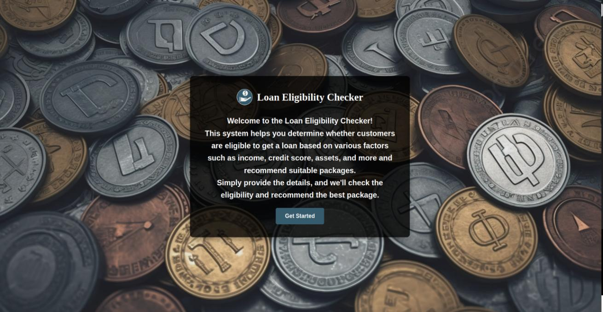
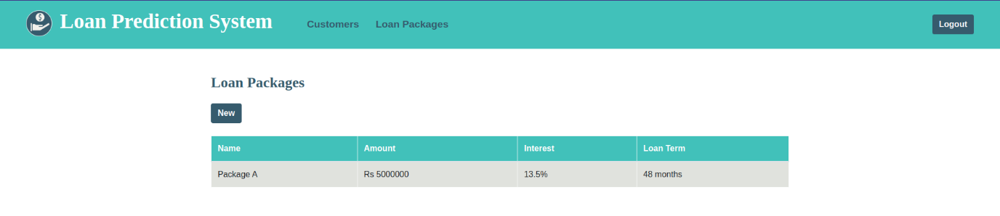
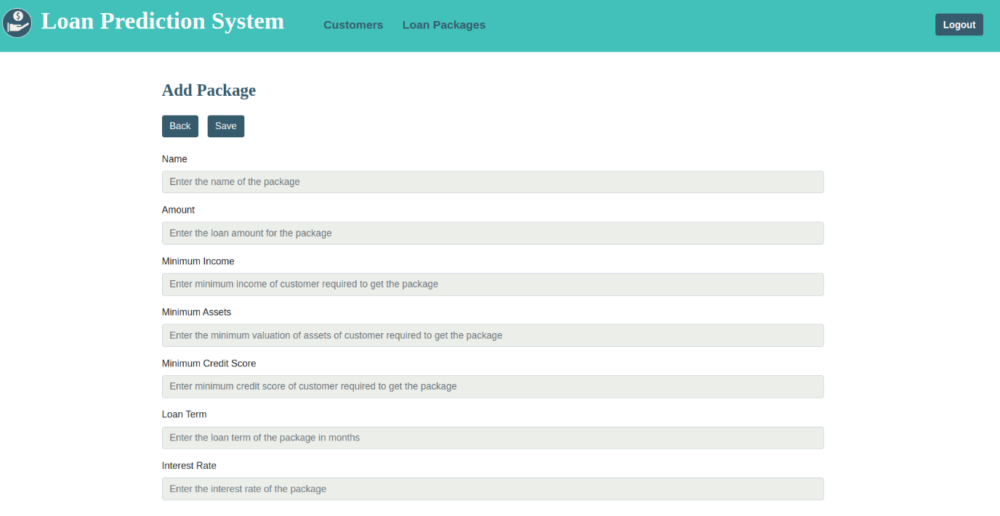
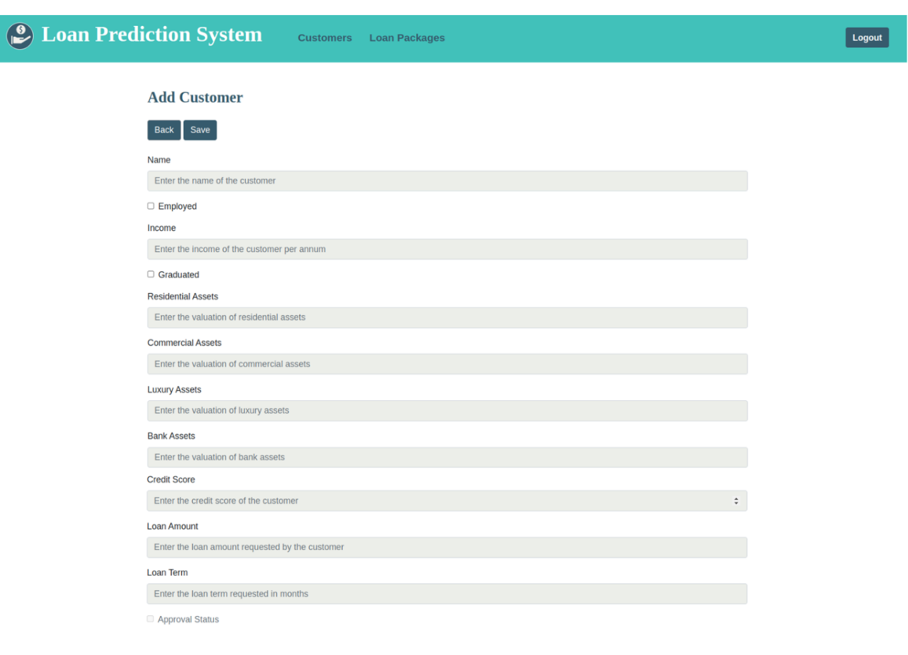
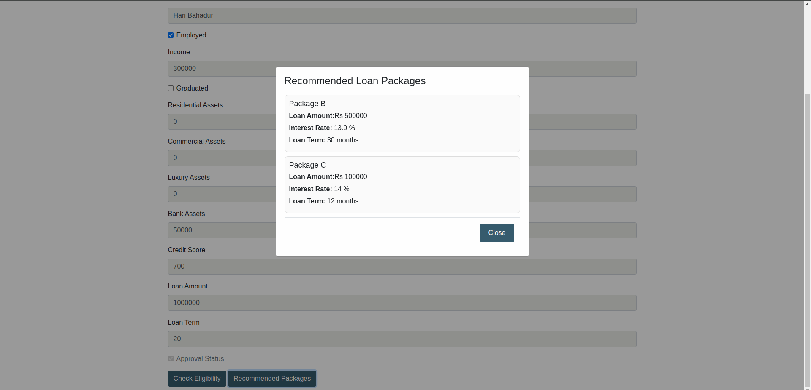

# Loan Eligibility Predictor System

This is a simple system where bank can register and add customer as well as loan packages.<br/>The customers detail can be used to predict whether they are eligible for loan approval or not.<br/>The eligible customers can also be recommended various appropriate loan packages.

## Setup
Clone or download the repository. Create python venv and install all required packages inside the venv:
```bash
pip install -r requirements.txt
```
Start the project by:
```bash
uvicorn app.main:app --reload
```
## Snaps




